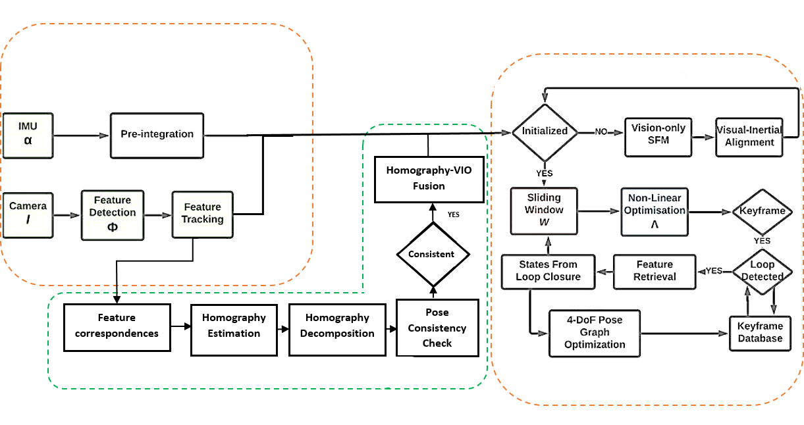
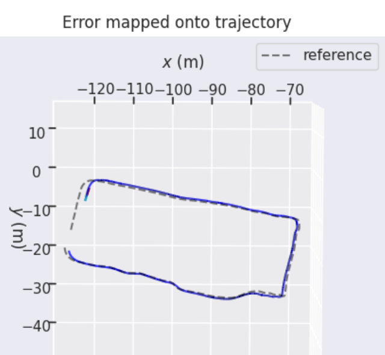

# VINS-Mono-HomographyFusion

> **This is a fork of [VINS-Mono](https://github.com/HKUST-Aerial-Robotics/VINS-Mono)** (HKUST Aerial Robotics, GPLv3). It adds an experimental module that estimates relative camera motion from planar homographies and selectively fuses it with VINS-Mono's visual-inertial pose estimate. All credit for the base system goes to the original authors (Tong Qin, Peiliang Li, Zhenfei Yang, Shaojie Shen) — see [Acknowledgements](#acknowledgements) and [Citation](#citation) below. The original VINS-Mono documentation continues unmodified beneath this section.

**Contents:** [What this adds](#what-this-adds) · [Results](#results) · [Known Limitations](#known-limitations--next-steps) · [Building & Running](#building--running) · [Acknowledgements](#acknowledgements)

## What this adds


*The orange boxes are unmodified VINS-Mono. The green box (feature correspondences → homography estimation → decomposition → pose consistency check) is the module added in this fork, gating into the existing "Homography-VIO Fusion" step before the sliding-window optimizer.*

Many indoor/structured environments contain dominant planar surfaces (floors, walls, aisles). When such a plane is visible, point correspondences between consecutive frames are related by a homography, which gives an independent estimate of relative camera rotation and translation *direction*. This fork adds a module that:

1. Estimates a homography between consecutive frames from tracked feature correspondences (RANSAC + `cv::findHomography`).
2. Decomposes it into candidate (R, t, n) solutions (`cv::decomposeHomographyMat`).
3. Transforms the result into the IMU frame and fuses it with VINS-Mono's own relative-motion estimate:
   - Rotation is blended via SLERP.
   - Translation is blended **only in direction** — VINS-Mono's metric scale is always preserved.
   - A direction-disagreement gate skips fusion when homography and VIO disagree beyond a threshold (guards against bad planar fits, e.g. on non-planar or degenerate scenes).

### Files changed relative to upstream VINS-Mono

| File | Change |
|---|---|
| `vins_estimator/src/homography_pose_estimator.{h,cpp}` | New: standalone homography → relative pose estimator |
| `vins_estimator/src/estimator.{h,cpp}` | Added `fuseHomographyWithVIO()` and the call site inside `processImage()` |
| `vins_estimator/launch/openloris.launch` | New launch file for running on OpenLORIS sequences |
| `test/test_homography.cpp` | Manual sanity check for the homography estimator (synthetic points, not a CI test suite) |

### New parameters (in `estimator.h`, currently hardcoded — see Limitations)

| Parameter | Meaning | Tested range | Best found |
|---|---|---|---|
| `homo_max_dir_angle_deg_` (τ_dir) | Max allowed angle between homography and VIO translation direction before fusion is skipped | 60°–150° | 120° |
| `homo_alpha_R_` (α_R) | Rotation blend weight (0 = pure VIO, 1 = pure homography) | 0.1–0.5 | 0.2 |
| `homo_alpha_t_` (α_t) | Translation-direction blend weight | 0.2–0.5 | 0.3 |

## Results

Evaluated on the **OpenLORIS-Market-1** sequence (narrow aisles, repetitive textures, occasional planar dominance), using EVO for Absolute Trajectory Error (ATE RMSE):

| Method | ATE RMSE [m] |
|---|---|
| **VINS-Mono (unmodified baseline)** | **0.84** |
| VINS-Mono-HomographyFusion (this fork, best config) | 1.14 |
| ADUGS-VINS | 1.27 |
| DM-VIO | 1.35 |
| VINS-Fusion | 1.42 |
| DS-SLAM | 2.27 |
| OpenVINS | 13.49 |
| DSO | 24.02 |

**Honest takeaway:** at the best configuration found (τ_dir = 120°, α_R = 0.2, α_t = 0.3), this fusion module does **not** outperform unmodified VINS-Mono on this sequence, though it remains competitive with several other VIO/SLAM systems. I'm including it because the negative result, the parameter sweep, and the implementation itself are still useful evidence of how this kind of fusion behaves — see [Known Limitations](#known-limitations--next-steps) for my current hypothesis on why it underperforms and what I'd try next.


*Best-performing configuration on OpenLORIS-Market-1: estimated trajectory (solid) vs. reference (dashed).*

## Known Limitations & Next Steps

Being upfront about the current state of the implementation:

- **Homography decomposition currently picks the first candidate solution from `cv::decomposeHomographyMat`, without a cheirality (positive-depth) check.** A proper implementation should triangulate a subset of points for each of the (up to 4) candidates and keep the one satisfying positive depth in both views, falling back to inlier count if more than one candidate survives. This is the next thing I plan to implement, and may close part of the gap to the VINS-Mono baseline above.
- **Fusion currently runs regardless of `solver_flag` (i.e., even before VINS-Mono has finished initializing).** During initialization, `Rs`/`Ps` aren't yet metric or gravity-aligned, so blending against them is questionable. Gating fusion to `solver_flag == NON_LINEAR` is an easy next experiment.
- The fusion mechanism works by overwriting the propagated pose (`Rs[k]`, `Ps[k]`) *before* nonlinear optimization runs — i.e., it perturbs the initial guess given to Ceres, rather than adding a homography residual directly into the joint cost function. That's a reasonable simplification but a weaker form of "fusion" than a true added factor.
- `test_homography.cpp` is a manual sanity check on synthetic points, not an automated test suite.

## Building & Running

Build instructions follow upstream VINS-Mono (Ubuntu 18.04, ROS Melodic, Ceres, see below). To run on OpenLORIS-Market-1:

```bash
roslaunch vins_estimator openloris.launch
```

Make sure `openloris_config.yaml` (camera intrinsics + IMU calibration for your sequence) is in place under `config/openloris/`.

## Acknowledgements

This project is built directly on top of **VINS-Mono**, developed by the HKUST Aerial Robotics Group. All core SLAM/VIO functionality (feature tracking, IMU pre-integration, initialization, sliding-window optimization, loop closure) is their work — this fork only adds the homography fusion module described above.

## Citation

If you use this code, please cite the original VINS-Mono paper:

```bibtex
@article{qin2018vins,
  title={Vins-mono: A robust and versatile monocular visual-inertial state estimator},
  author={Qin, Tong and Li, Peiliang and Shen, Shaojie},
  journal={IEEE Transactions on Robotics},
  year={2018}
}
```

## License

GPLv3, inherited from upstream VINS-Mono.

---


# Original VINS-Mono 
## A Robust and Versatile Monocular Visual-Inertial State Estimator

**11 Jan 2019**: An extension of **VINS**, which supports stereo cameras / stereo cameras + IMU / mono camera + IMU, is published at [VINS-Fusion](https://github.com/HKUST-Aerial-Robotics/VINS-Fusion)

**29 Dec 2017**: New features: Add map merge, pose graph reuse, online temporal calibration function, and support rolling shutter camera. Map reuse videos: 

<a href="https://www.youtube.com/embed/WDpH80nfZes" target="_blank"></a>
<a href="https://www.youtube.com/embed/eINyJHB34uU" target="_blank"></a>

VINS-Mono is a real-time SLAM framework for **Monocular Visual-Inertial Systems**. It uses an optimization-based sliding window formulation for providing high-accuracy visual-inertial odometry. It features efficient IMU pre-integration with bias correction, automatic estimator initialization, online extrinsic calibration, failure detection and recovery, loop detection, and global pose graph optimization, map merge, pose graph reuse, online temporal calibration, rolling shutter support. VINS-Mono is primarily designed for state estimation and feedback control of autonomous drones, but it is also capable of providing accurate localization for AR applications. This code runs on **Linux**, and is fully integrated with **ROS**. For **iOS** mobile implementation, please go to [VINS-Mobile](https://github.com/HKUST-Aerial-Robotics/VINS-Mobile).

**Authors:** [Tong Qin](http://www.qintonguav.com), [Peiliang Li](https://github.com/PeiliangLi), [Zhenfei Yang](https://github.com/dvorak0), and [Shaojie Shen](http://www.ece.ust.hk/ece.php/profile/facultydetail/eeshaojie) from the [HKUST Aerial Robotics Group](http://uav.ust.hk/)

**Videos:**

<a href="https://www.youtube.com/embed/mv_9snb_bKs" target="_blank"></a>
<a href="https://www.youtube.com/embed/g_wN0Nt0VAU" target="_blank"></a>
<a href="https://www.youtube.com/embed/I4txdvGhT6I" target="_blank"></a>

EuRoC dataset;                  Indoor and outdoor performance;                         AR application;

<a href="https://www.youtube.com/embed/2zE84HqT0es" target="_blank"></a>
<a href="https://www.youtube.com/embed/CI01qbPWlYY" target="_blank"></a>

 MAV application;               Mobile implementation (Video link for mainland China friends: [Video1](http://www.bilibili.com/video/av10813254/) [Video2](http://www.bilibili.com/video/av10813205/) [Video3](http://www.bilibili.com/video/av10813089/) [Video4](http://www.bilibili.com/video/av10813325/) [Video5](http://www.bilibili.com/video/av10813030/))

**Related Papers**

* **Online Temporal Calibration for Monocular Visual-Inertial Systems**, Tong Qin, Shaojie Shen, IEEE/RSJ International Conference on Intelligent Robots and Systems (IROS, 2018), **best student paper award** [pdf](https://ieeexplore.ieee.org/abstract/document/8593603)

* **VINS-Mono: A Robust and Versatile Monocular Visual-Inertial State Estimator**, Tong Qin, Peiliang Li, Zhenfei Yang, Shaojie Shen, IEEE Transactions on Robotics[pdf](https://ieeexplore.ieee.org/document/8421746/?arnumber=8421746&source=authoralert) 

*If you use VINS-Mono for your academic research, please cite at least one of our related papers.*[bib](https://github.com/HKUST-Aerial-Robotics/VINS-Mono/blob/master/support_files/paper_bib.txt)

## 1. Prerequisites
1.1 **Ubuntu** and **ROS**
Ubuntu  16.04.
ROS Kinetic. [ROS Installation](http://wiki.ros.org/ROS/Installation)
additional ROS pacakge
```
    sudo apt-get install ros-YOUR_DISTRO-cv-bridge ros-YOUR_DISTRO-tf ros-YOUR_DISTRO-message-filters ros-YOUR_DISTRO-image-transport
```


1.2. **Ceres Solver**
Follow [Ceres Installation](http://ceres-solver.org/installation.html), use **version 1.14.0** and remember to **sudo make install**. (There are compilation issues in Ceres versions 2.0.0 and above.)

## 2. Build VINS-Mono on ROS
Clone the repository and catkin_make:
```
    cd ~/catkin_ws/src
    git clone https://github.com/HKUST-Aerial-Robotics/VINS-Mono.git
    cd ../
    catkin_make
    source ~/catkin_ws/devel/setup.bash
```

## 3. Visual-Inertial Odometry and Pose Graph Reuse on Public datasets
Download [EuRoC MAV Dataset](http://projects.asl.ethz.ch/datasets/doku.php?id=kmavvisualinertialdatasets). Although it contains stereo cameras, we only use one camera. The system also works with [ETH-asl cla dataset](http://robotics.ethz.ch/~asl-datasets/maplab/multi_session_mapping_CLA/bags/). We take EuRoC as the example.

**3.1 visual-inertial odometry and loop closure**

3.1.1 Open three terminals, launch the vins_estimator , rviz and play the bag file respectively. Take MH_01 for example
```
    roslaunch vins_estimator euroc.launch 
    roslaunch vins_estimator vins_rviz.launch
    rosbag play YOUR_PATH_TO_DATASET/MH_01_easy.bag 
```
(If you fail to open vins_rviz.launch, just open an empty rviz, then load the config file: file -> Open Config-> YOUR_VINS_FOLDER/config/vins_rviz_config.rviz)

3.1.2 (Optional) Visualize ground truth. We write a naive benchmark publisher to help you visualize the ground truth. It uses a naive strategy to align VINS with ground truth. Just for visualization. not for quantitative comparison on academic publications.
```
    roslaunch benchmark_publisher publish.launch  sequence_name:=MH_05_difficult
```
 (Green line is VINS result, red line is ground truth). 
 
3.1.3 (Optional) You can even run EuRoC **without extrinsic parameters** between camera and IMU. We will calibrate them online. Replace the first command with:
```
    roslaunch vins_estimator euroc_no_extrinsic_param.launch
```
**No extrinsic parameters** in that config file.  Waiting a few seconds for initial calibration. Sometimes you cannot feel any difference as the calibration is done quickly.

**3.2 map merge**

After playing MH_01 bag, you can continue playing MH_02 bag, MH_03 bag ... The system will merge them according to the loop closure.

**3.3 map reuse**

3.3.1 map save

Set the **pose_graph_save_path** in the config file (YOUR_VINS_FOLEDER/config/euroc/euroc_config.yaml). After playing MH_01 bag, input **s** in vins_estimator terminal, then **enter**. The current pose graph will be saved. 

3.3.2 map load

Set the **load_previous_pose_graph** to 1 before doing 3.1.1. The system will load previous pose graph from **pose_graph_save_path**. Then you can play MH_02 bag. New sequence will be aligned to the previous pose graph.

## 4. AR Demo
4.1 Download the [bag file](https://www.dropbox.com/s/s29oygyhwmllw9k/ar_box.bag?dl=0), which is collected from HKUST Robotic Institute. For friends in mainland China, download from [bag file](https://pan.baidu.com/s/1geEyHNl).

4.2 Open three terminals, launch the ar_demo, rviz and play the bag file respectively.
```
    roslaunch ar_demo 3dm_bag.launch
    roslaunch ar_demo ar_rviz.launch
    rosbag play YOUR_PATH_TO_DATASET/ar_box.bag 
```
We put one 0.8m x 0.8m x 0.8m virtual box in front of your view. 

## 5. Run with your device 

Suppose you are familiar with ROS and you can get a camera and an IMU with raw metric measurements in ROS topic, you can follow these steps to set up your device. For beginners, we highly recommend you to first try out [VINS-Mobile](https://github.com/HKUST-Aerial-Robotics/VINS-Mobile) if you have iOS devices since you don't need to set up anything.

5.1 Change to your topic name in the config file. The image should exceed 20Hz and IMU should exceed 100Hz. Both image and IMU should have the accurate time stamp. IMU should contain absolute acceleration values including gravity.

5.2 Camera calibration:

We support the [pinhole model](http://docs.opencv.org/2.4.8/modules/calib3d/doc/camera_calibration_and_3d_reconstruction.html) and the [MEI model](http://www.robots.ox.ac.uk/~cmei/articles/single_viewpoint_calib_mei_07.pdf). You can calibrate your camera with any tools you like. Just write the parameters in the config file in the right format. If you use rolling shutter camera, please carefully calibrate your camera, making sure the reprojection error is less than 0.5 pixel.

5.3 **Camera-Imu extrinsic parameters**:

If you have seen the config files for EuRoC and AR demos, you can find that we can estimate and refine them online. If you familiar with transformation, you can figure out the rotation and position by your eyes or via hand measurements. Then write these values into config as the initial guess. Our estimator will refine extrinsic parameters online. If you don't know anything about the camera-IMU transformation, just ignore the extrinsic parameters and set the **estimate_extrinsic** to **2**, and rotate your device set at the beginning for a few seconds. When the system works successfully, we will save the calibration result. you can use these result as initial values for next time. An example of how to set the extrinsic parameters is in[extrinsic_parameter_example](https://github.com/HKUST-Aerial-Robotics/VINS-Mono/blob/master/config/extrinsic_parameter_example.pdf)

5.4 **Temporal calibration**:
Most self-made visual-inertial sensor sets are unsynchronized. You can set **estimate_td** to 1 to online estimate the time offset between your camera and IMU.  

5.5 **Rolling shutter**:
For rolling shutter camera (carefully calibrated, reprojection error under 0.5 pixel), set **rolling_shutter** to 1. Also, you should set rolling shutter readout time **rolling_shutter_tr**, which is from sensor datasheet(usually 0-0.05s, not exposure time). Don't try web camera, the web camera is so awful.

5.6 Other parameter settings: Details are included in the config file.

5.7 Performance on different devices: 

(global shutter camera + synchronized high-end IMU, e.g. VI-Sensor) > (global shutter camera + synchronized low-end IMU) > (global camera + unsync high frequency IMU) > (global camera + unsync low frequency IMU) > (rolling camera + unsync low frequency IMU). 

## 6. Docker Support

To further facilitate the building process, we add docker in our code. Docker environment is like a sandbox, thus makes our code environment-independent. To run with docker, first make sure [ros](http://wiki.ros.org/ROS/Installation) and [docker](https://docs.docker.com/install/linux/docker-ce/ubuntu/) are installed on your machine. Then add your account to `docker` group by `sudo usermod -aG docker $YOUR_USER_NAME`. **Relaunch the terminal or logout and re-login if you get `Permission denied` error**, type:
```
cd ~/catkin_ws/src/VINS-Mono/docker
make build
./run.sh LAUNCH_FILE_NAME   # ./run.sh euroc.launch
```
Note that the docker building process may take a while depends on your network and machine. After VINS-Mono successfully started, open another terminal and play your bag file, then you should be able to see the result. If you need modify the code, simply run `./run.sh LAUNCH_FILE_NAME` after your changes.


## 7. Acknowledgements
We use [ceres solver](http://ceres-solver.org/) for non-linear optimization and [DBoW2](https://github.com/dorian3d/DBoW2) for loop detection, and a generic [camera model](https://github.com/hengli/camodocal).

## 8. Licence
The source code is released under [GPLv3](http://www.gnu.org/licenses/) license.

We are still working on improving the code reliability. For any technical issues, please contact Tong QIN <tong.qinATconnect.ust.hk> or Peiliang LI <pliapATconnect.ust.hk>.

For commercial inquiries, please contact Shaojie SHEN <eeshaojieATust.hk>
